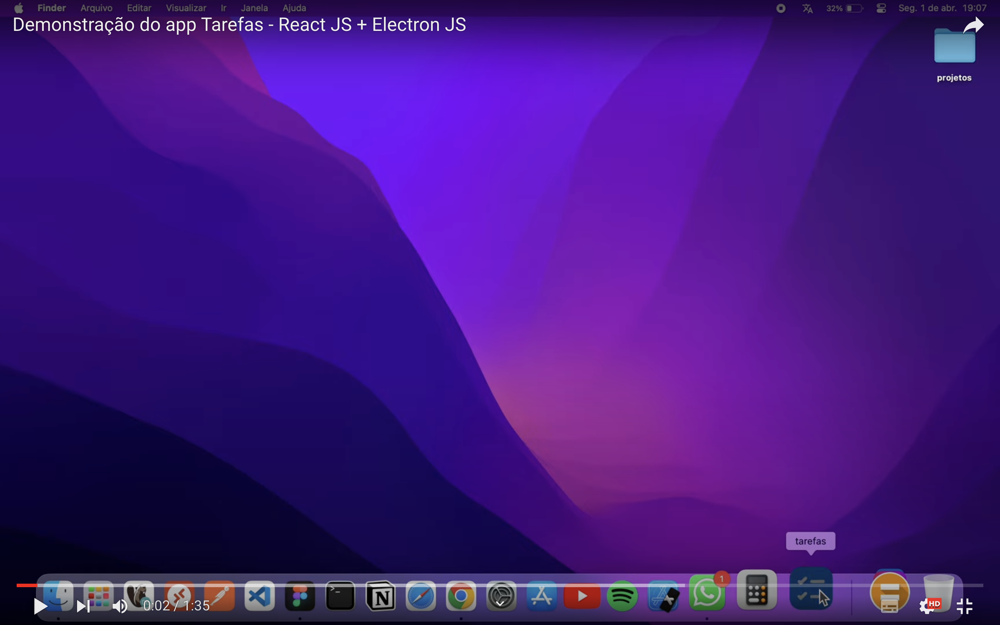
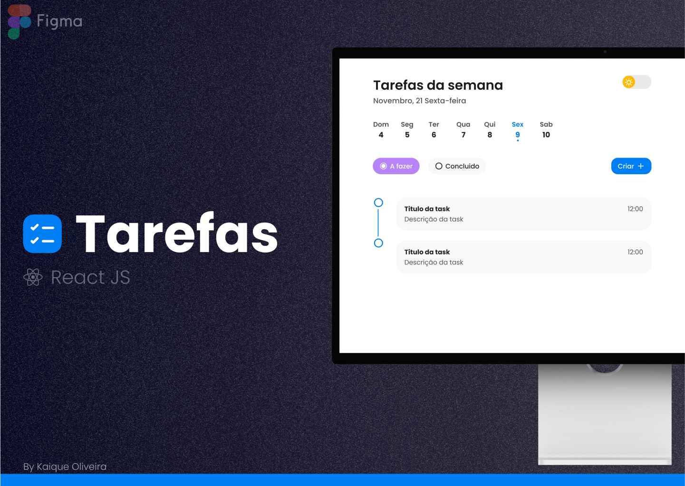

<h1 align="center">
  <br>

  <br>
Tarefas
  <br>
</h1>

<h4 align="center">Um aplicativo para organizar as tarefas utilizando <a href="https://pt-br.react.dev/blog/2023/03/16/introducing-react-dev" target="_blank">React JS</a> e <a href="https://www.electronjs.org" target="_blank">Electron JS</a>.</h4>


<p>Clique no player para visualizar a demonstração no YouTube 🖥️.</p>

[](https://youtu.be/9PZDyHuJpeM?si=4EeyMRLb_5q9wMgi "Assistir ao video")


## Protótipo figma

<p>Clique na imagem para visualizar no figma.</p>

  [](https://www.figma.com/file/pf0dNRmKaBnkNQoKFbZpkz/portif%C3%B3lio?type=design&node-id=0%3A1&mode=design&t=GS4wXvXttCvAZyaj-1 "Visualizar no figma")


## Sobre o app Tarefas

Imagine um aplicativo que funciona como seu assistente pessoal para manter suas tarefas organizadas e sua vida mais tranquila. Esse é o propósito do app desenvolvido com React JS e Electron.

Com ele, você pode criar listas de tarefas facilmente, durante sete dias da semenas, sempre se baseando no dia atual.

O melhor de tudo é a possibilidade de acessar o aplicativo no Windows, Mac e Linux.

Com uma interface intuitiva e amigável, podendo ser alternado entre o modo light ou dark.

Todas as tarefas são salvas localmente, garantindo a visualização a qualquer momento, mesmo que o app seja encerrado.

## Como usar

Para clonar e executar este aplicativo, você precisará do [Git](https://git-scm.com) e do [Node.js](https://nodejs.org/en/download/) (que vem com o [npm](http://npmjs.com)) instalados em seu computador. 
<br>
Na sua linha de comando:

```bash
# Clone o repositorio
$ git clone https://github.com/kaique-oliveira/tarefas-web.git

# Entre no repositório
$ cd tarefas-web

# Instalar dependências
$ npm install

# Execute o aplicativo
$ npm run start 

# Para gerar o instalavel do Windows
$ npm run build-win

# Para gerar o instalavel do Mac OS
$ npm run build-mac
```

## Credits

Principais frameworks e bibliotecas utilizados:

- [React-JS](https://pt-br.react.dev/blog/2023/03/16/introducing-react-dev)
- [Electron-JS](https://www.electronjs.org)
- [TypeScript](https://www.typescriptlang.org)
- [Styled-Components](https://styled-components.com)
- [Phosphor-React-Native](https://github.com/duongdev/phosphor-react-native)
- [Vite](https://vitejs-dev.translate.goog/?_x_tr_sl=en&_x_tr_tl=pt&_x_tr_hl=pt-BR&_x_tr_pto=sc)
- [React-Indexed-DB](https://www.npmjs.com/package/react-indexed-db)


---

> GitHub [@kaique-oliveira](https://github.com/kaique-oliveira) &nbsp;&middot;&nbsp;
> Linkedin [@kaique-oliveira](https://www.linkedin.com/in/kaique-oliveira-a21273162/)

